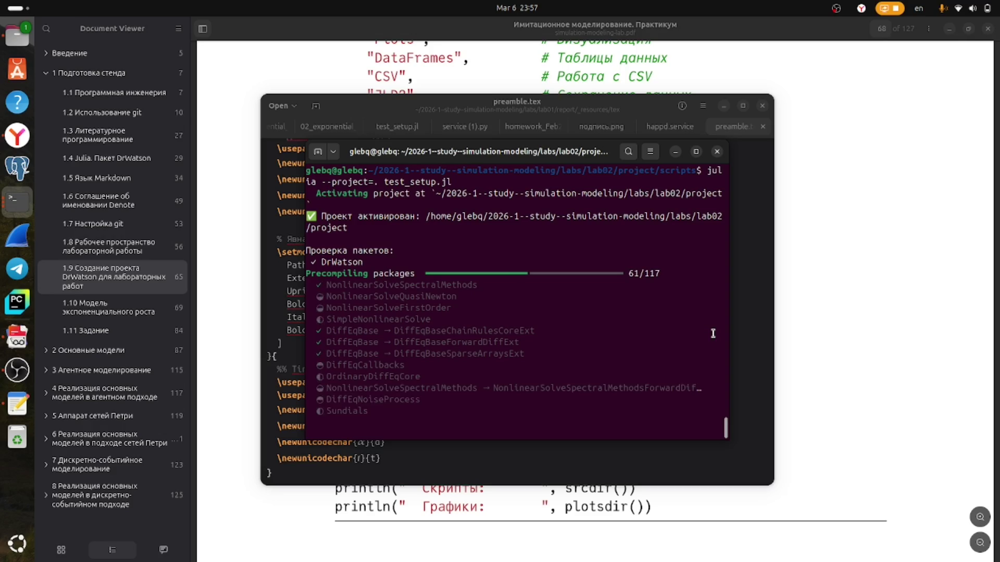
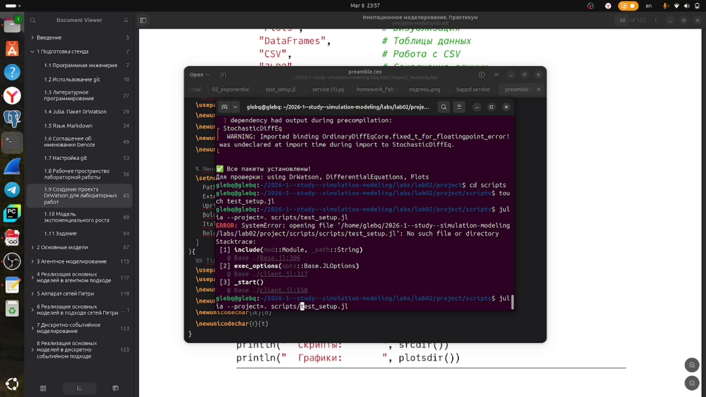

---
## Author
author:
  name: Глеб Беспутин
  email: glebb2005@mail.ru
title: "Лабораторная работа №2: Модель SIR,  Модель Лотки–Вольтерры"
subtitle: "Имитационное моделирование"
license: "CC BY"
---

# Цель работы

Изучить две модели: модель SIR,  модель Лотки–Вольтерры

# Задание 

1. Создать рабочий каталог для кода.
2. Установить необходимые пакеты.
3. Выполнить предложенный код.
4. Преобразовать код в литературный стиль.
5. Сгенерировать из литературного кода чистый код, jupyter notebook, документацию в формате Quarto.
6. Выполнить код из jupyter notebook.
7. Интегрировать документацию в формате Quarto в отчёт.
8. Добавить в код в литературном стиле вычисление для набора параметров.
9. Сгенерировать из литературного кода с параметрами: чистый код, jupyter notebook, документацию в формате Quarto.
10. Выполнить код из jupyter notebook с параметрами. 
11. Интегрировать документацию с параметрами в формате Quarto в отчёт.

# Теоретическое введение

Модель SIR есть классическая и фундаментальная математическая модель эпиде-
миологии, описывающая распространение инфекционного заболевания в закры-
той популяции

Модель Лотки-Вольтерры — это фундаментальная математическая модель в эко-
логии, описывающая динамику взаимодействия двух видов: хищников и жертв.
Она была независимо предложена в 1920-х годах:

— Альфредом Лоткой (1925) для химических реакций [5; 6].

— Витторио Вольтеррой (1926) для объяснения колебаний улова рыбы в Адриати-
ческом море [8; 9].

Модель демонстрирует, как даже простая система взаимодействий может порож-
дать сложные колебательные режимы, объясняя циклические изменения числен-
ности в природных экосистемах.

# Выполнение лабораторной работы

## 1. Создать рабочий каталог для курса

Создаю рабочий каталог для курса ([рис. @fig-001]).

{#fig-001 width=70%}

## 2. Установить необходимые пакеты

Устанавливаю необходимые пакеты ([рис. @fig-002]).

{#fig-002 width=70%}

## 3. Выполнить код

Выполняю код исп команды julia sir_ode.jl , julia lv_ode.jl

## 4. Преобразовть код в литературный стиль.

Преобразовываю код в литераурный стиль (Можно посмотреть в конце отчета )

## 5. Создаю производные форматы

Создаю производные форматы

## 6. Выполнить jupyter

Выполняю  jupyter

## 7.  Интегрировать документацию в формате Quarto в отчёт

Интегрирую  документацию в формате Quarto в отчёт

## 8. Добавить в код в литературном стиле вычисление для набора параметров.

Добавляю в код в литературном стиле вычисление для набора параметров.

## 9. Сгенерировать из литературного кода с параметрами: чистый код, jupyter notebook, документацию в формате Quarto.

Генерирую из литературного кода с параметрами: чистый код, jupyter notebook, документацию в формате Quarto.

## 10. Выполнить код из jupyter notebook с параметрами. 

Выполняю код из jupyter notebook с параметрами

## 11. Интегрировать документацию с параметрами в формате Quarto в отчёт.

Интегрирую документацию с параметрами в формате Quarto в отчёт.









::: {#refs}
:::
