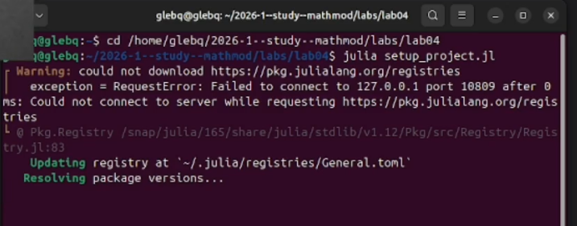
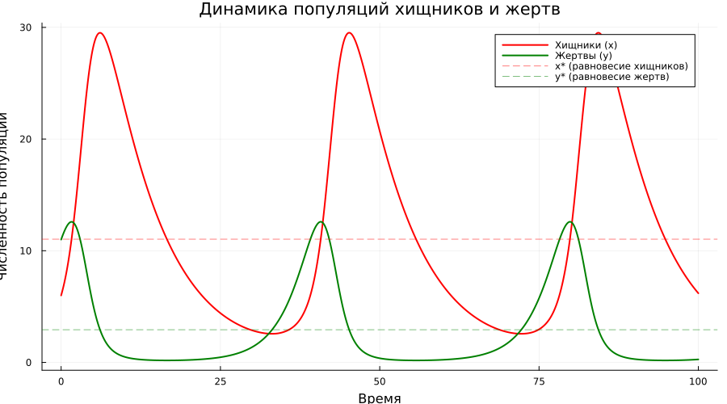
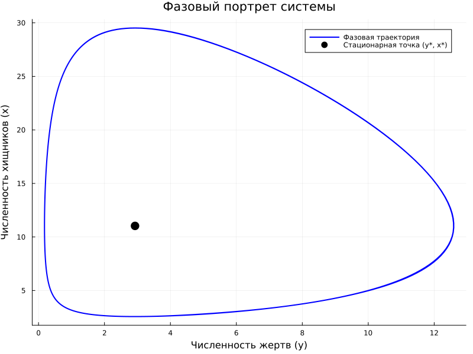

# Информация

## Докладчик

:::::::::::::: {.columns align=center}
::: {.column width="70%"}

  * Глеб Б.
  * Студент
  * Российский университет дружбы народов им. П. Лумумбы
  * [glebb2005@mail.ru](mailto:glebb2005@mail.ru)

:::
::: {.column width="30%"}

:::
::::::::::::::

# Вводная часть

## Актуальность

- Моделирование популяционной динамики важно для экологии и биологии

- Модель Лотки-Вольтерры — фундаментальная основа для понимания взаимодействия видов

- Позволяет прогнозировать циклические изменения численности популяций

- Применяется в экономике, эпидемиологии и других областях

- Демонстрирует эмерджентное поведение из простых правил взаимодействия

## Объект и предмет исследования

- **Объект:** математические модели популяционной динамики

- **Предмет:** система дифференциальных уравнений Лотки-Вольтерры, описывающая взаимодействие популяций хищников и жертв

## Цели и задачи

**Цель:** Изучить классическую модель Лотки-Вольтерры и исследовать её динамику.

**Задачи:**

1. Реализовать модель для заданного варианта параметров

2. Найти стационарное состояние системы

3. Построить графики динамики популяций во времени

4. Построить фазовый портрет системы

5. Проанализировать характер колебаний и сдвиг фаз

6. Оформить результаты в виде отчёта и презентации

## Материалы и методы

- Язык программирования Julia

- Пакет OrdinaryDiffEq для решения систем ОДУ

- Plots для визуализации

- DataFrames для работы с данными

- DrWatson для управления проектом

- Literate.jl для литературного программирования

# Содержание исследования

## Модель Лотки-Вольтерры

Система дифференциальных уравнений:

$$
\begin{cases}
\frac{dx}{dt} = -a x(t) + b x(t)y(t) & \text{(хищники)} \\
\frac{dy}{dt} = c y(t) - d x(t)y(t) & \text{(жертвы)}
\end{cases}
$$

Параметры модели:
- $a$ — естественная смертность хищников
- $b$ — прирост хищников за счёт жертв
- $c$ — естественный прирост жертв
- $d$ — смертность жертв от хищников

## Стационарное состояние

Из условия $\frac{dx}{dt} = 0$ и $\frac{dy}{dt} = 0$:

$$
x^* = \frac{c}{d}, \quad y^* = \frac{a}{b}
$$

Свойства стационарной точки:
- Нейтрально устойчивый центр
- При отклонении — незатухающие колебания
- Амплитуда зависит от начальных условий
- Период малых колебаний: $T \approx \frac{2\pi}{\sqrt{ac}}$

## Параметры варианта 1

Согласно заданию:

$$
\begin{cases}
\frac{dx}{dt} = -0.12x(t) + 0.041x(t)y(t) \\
\frac{dy}{dt} = 0.32y(t) - 0.029x(t)y(t)
\end{cases}
$$

Начальные условия: $x_0 = 6$, $y_0 = 11$

Стационарное состояние:
- $x^* = 0.32 / 0.029 \approx 11.03$ (хищники)
- $y^* = 0.12 / 0.041 \approx 2.93$ (жертвы)

## Настройка окружения

## Литературное программирование

Все скрипты преобразованы в литературный стиль. Сгенерированы:

- Чистый код
- Jupyter Notebook
- Quarto-документ

## Динамика популяций во времени

Результаты:
- Периодические колебания обеих популяций
- Пик хищников отстаёт от пика жертв (сдвиг фаз ~ 1/4 периода)
- Колебания происходят вокруг стационарных значений
- Амплитуда определяется начальными условиями

## Фазовый портрет

Характеристики:
- Замкнутая траектория вокруг стационарной точки
- Консервативная система (сохраняется величина $V(x,y)$)
- Направление движения — против часовой стрелки
- Чёрная точка — стационарное состояние $(2.93, 11.03)$

## Анализ колебаний

| Характеристика | Значение |
|----------------|----------|
| Период колебаний | ~ 20-25 ед. времени |
| Макс. хищников | ~ 20-22 |
| Мин. хищников | ~ 4-5 |
| Макс. жертв | ~ 13-15 |
| Мин. жертв | ~ 0.5-1 |

Сдвиг фаз: пик хищников отстаёт от пика жертв на ~ 5-6 единиц времени.

## Сравнение с реальными экосистемами

**Модель предсказывает:**
- Циклические колебания численности
- Запаздывание реакции хищников

**Реальные данные (примеры):**
- Рыси и зайцы в Канаде (данные Hudson Bay Company)
- Волки и лоси на острове Айл-Ройал
- Колебания улова рыбы в Адриатике

Модель качественно верно описывает наблюдаемые циклы.

## Ограничения модели

- Отсутствие внутривидовой конкуренции
- Нет ограничений по ресурсам (ёмкость среды)
- Постоянные параметры взаимодействия
- Нет пространственной структуры
- Нейтральная устойчивость (нереалистична)

**Модификации:**
- Логистический рост жертв
- Функциональный ответ Холлинга
- Учёт возрастной структуры

# Результаты

## Основные итоги

1. Реализована модель Лотки-Вольтерры для варианта 1

2. Найдено стационарное состояние: $x^* \approx 11.03$, $y^* \approx 2.93$

3. Построены графики динамики популяций во времени

4. Построен фазовый портрет системы

5. Проанализирован характер колебаний и сдвиг фаз

6. Освоены инструменты литературного программирования

## Демонстрация работы

- Модель успешно запускается для заданных параметров
- Графики сохраняются в каталог plots/lab05_var01/
- Данные сохраняются в data/lab05_var01/
- Сгенерированы Jupyter Notebook и Quarto-документы
- Наглядно виден циклический характер взаимодействия

# Выводы

## Заключение

Модель Лотки-Вольтерры демонстрирует:

- Эмерджентное поведение из простых правил взаимодействия
- Циклические колебания численности популяций
- Запаздывание реакции хищников на изменение численности жертв
- Существование стационарного состояния

**Главный вывод:** Даже простая система из двух дифференциальных уравнений способна качественно описать сложную динамику экосистем, наблюдаемую в природе.

# Рекомендации

## Применение модели

- Обучение основам математической экологии
- Качественный анализ популяционной динамики
- Базовая модель для более сложных модификаций
- Изучение концепции эмерджентного поведения

## Использованные инструменты

| Инструмент | Назначение |
|------------|------------|
| Julia | Язык программирования |
| OrdinaryDiffEq | Решение систем ОДУ |
| Plots | Визуализация |
| DataFrames | Работа с табличными данными |
| DrWatson | Управление проектом |
| Literate.jl | Литературное программирование |
| Quarto | Подготовка отчётов и презентаций |
