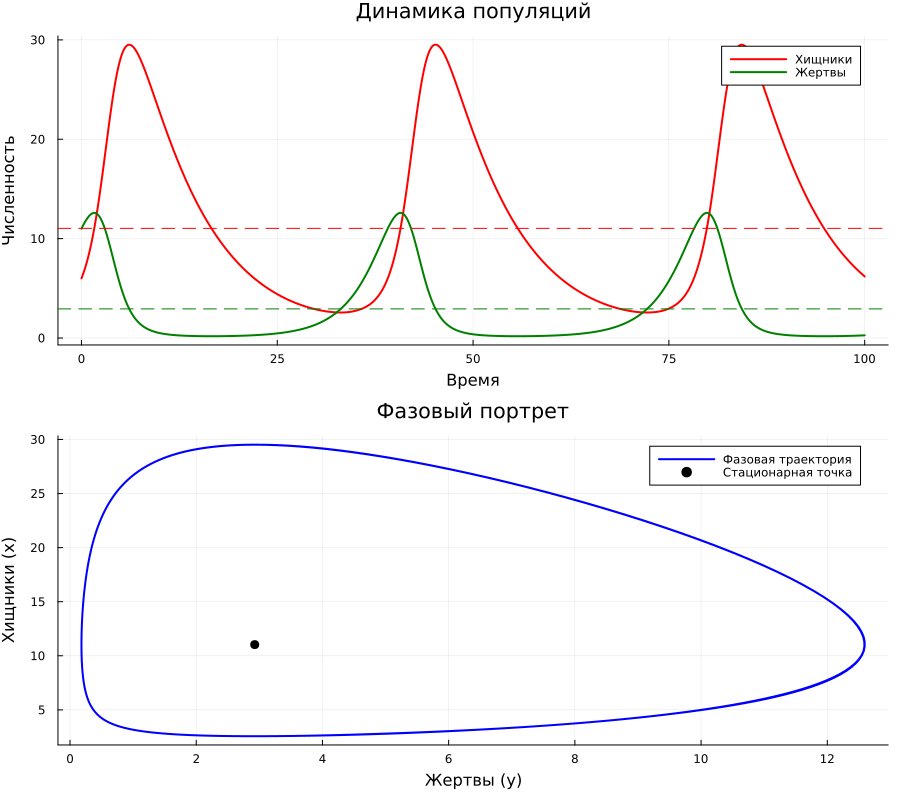

---
## Author
author:
  name: Беспутин Глеб Антонович
  email: glebb2005@mail.ru
  affiliation:
    - name: Российский университет дружбы народов
      country: Российская Федерация
      city: Москва
      address: ул. Миклухо-Маклая, д. 6

## Title
title: "Лабораторная работа №5"
subtitle: "Математическое моделирование"
license: "CC BY"
---

# Цель работы

Изучить классическую модель взаимодействия двух видов «хищник-жертва» (модель Лотки-Вольтерры). Научиться находить стационарное состояние системы, строить графики динамики популяций и фазовые портреты с использованием пакета DifferentialEquations.jl в Julia.

# Задание

1. Создать рабочий каталог для кода лабораторной работы.
2. Установить необходимые пакеты.
3. Реализовать модель Лотки-Вольтерры для заданного варианта.
4. Найти стационарное состояние системы.
5. Построить график зависимости численности хищников от численности жертв (фазовый портрет).
6. Построить графики изменения численности хищников и жертв во времени.
7. Преобразовать код в литературный стиль.
8. Сгенерировать чистый код, Jupyter Notebook и Quarto-документ.
9. Интегрировать полученные результаты в отчёт.

# Теоретическое введение

## Модель Лотки-Вольтерры

Модель Лотки-Вольтерры — это фундаментальная математическая модель в экологии, описывающая динамику взаимодействия двух видов: хищников и жертв. Она была независимо предложена Альфредом Лоткой (1925) и Витторио Вольтеррой (1926).

Система состоит из двух дифференциальных уравнений:

$$
\begin{cases}
\frac{dx}{dt} = -a x(t) + b x(t)y(t) \\
\frac{dy}{dt} = c y(t) - d x(t)y(t)
\end{cases}
$$

где:
- $x(t)$ — численность хищников,
- $y(t)$ — численность жертв,
- $a$ — коэффициент естественной смертности хищников,
- $b$ — коэффициент прироста хищников за счёт поедания жертв,
- $c$ — коэффициент естественного прироста жертв,
- $d$ — коэффициент смертности жертв из-за хищников.

## Стационарное состояние

Стационарное состояние $(x^*, y^*)$ находится из условия $\frac{dx}{dt} = 0$ и $\frac{dy}{dt} = 0$:

$$
x^* = \frac{c}{d}, \quad y^* = \frac{a}{b}
$$

В этой точке численности обеих популяций остаются постоянными. При малых отклонениях от положения равновесия система совершает периодические колебания вокруг стационарной точки. Колебания происходят в противофазе: рост численности жертв приводит к последующему росту численности хищников, что в свою очередь вызывает сокращение популяции жертв и последующее сокращение популяции хищников.

# Выполнение лабораторной работы

## Настройка рабочего окружения

Был создан проект DrWatson и установлены необходимые пакеты: DrWatson, DifferentialEquations, Plots, DataFrames, JLD2.


## Параметры варианта 1

Согласно заданию, вариант 1 имеет следующие параметры:

$$
\begin{cases}
\frac{dx}{dt} = -0.12x(t) + 0.041x(t)y(t) \\
\frac{dy}{dt} = 0.32y(t) - 0.029x(t)y(t)
\end{cases}
$$

Начальные условия: $x_0 = 6$, $y_0 = 11$.

Коэффициенты модели:
- $a = 0.12$ — смертность хищников,
- $b = 0.041$ — прирост хищников,
- $c = 0.32$ — прирост жертв,
- $d = 0.029$ — смертность жертв.

## Литературное программирование

Скрипт модели был преобразован в литературный стиль. Сгенерированы чистый код, Jupyter Notebook и Quarto-документ с помощью команды:

```bash
julia --project=. scripts/tangle.jl scripts/lab05_var01.jl
```


## Стационарное состояние системы

Аналитически найдено стационарное состояние:

$$
x^* = \frac{c}{d} = \frac{0.32}{0.029} \approx 11.034
$$
$$
y^* = \frac{a}{b} = \frac{0.12}{0.041} \approx 2.927
$$

Таким образом, равновесная численность хищников составляет примерно 11 особей, а жертв — примерно 3 особи.

## Динамика популяций во времени

На графике представлено изменение численности хищников $x(t)$ и жертв $y(t)$ на интервале времени $t \in [0, 100]$.


На графике чётко видны периодические колебания обеих популяций. Колебания происходят в противофазе: пик численности хищников отстаёт от пика численности жертв примерно на четверть периода. Горизонтальными пунктирными линиями показаны стационарные значения $x^*$ и $y^*$, вокруг которых происходят колебания.

## Фазовый портрет

Фазовый портрет показывает зависимость численности хищников от численности жертв.


Фазовая траектория представляет собой замкнутую кривую, что характерно для консервативной системы Лотки-Вольтерры. Чёрной точкой отмечено стационарное состояние $(y^*, x^*) \approx (2.93, 11.03)$. Система совершает периодические колебания вокруг этой точки, при этом амплитуда колебаний определяется начальными условиями.

## Объединённый график

Для удобства анализа построен объединённый график, содержащий как временные зависимости, так и фазовый портрет.



# Выводы

В ходе выполнения лабораторной работы были достигнуты следующие результаты:

1. Реализована классическая модель Лотки-Вольтерры для варианта 1 с параметрами $a=0.12$, $b=0.041$, $c=0.32$, $d=0.029$.

2. Найдено стационарное состояние системы: $x^* \approx 11.03$ (хищники), $y^* \approx 2.93$ (жертвы).

3. Построены графики динамики популяций, демонстрирующие периодические колебания численности хищников и жертв в противофазе.

4. Построен фазовый портрет, представляющий собой замкнутую траекторию вокруг стационарной точки.

5. Освоены инструменты литературного программирования и генерации производных форматов (чистый код, Jupyter Notebook, Quarto).

Модель Лотки-Вольтерры, несмотря на свою простоту, качественно верно описывает циклический характер взаимодействия популяций хищников и жертв, наблюдаемый в природе.



# Список литературы{.unnumbered}

1. Д. С. Кулябов, А. В. Королькова. Имитационное моделирование. Практикум. — 2024.
2. Lotka A. J. Elements of Physical Biology. — Baltimore: Williams, Wilkins Company, 1925.
3. Volterra V. Variations and fluctuations of the number of individuals in animal species living together // Journal du Conseil permanent International pour l'Exploration de la Mer. — 1928. — Vol. 3, no. 1. — P. 3-51.в
