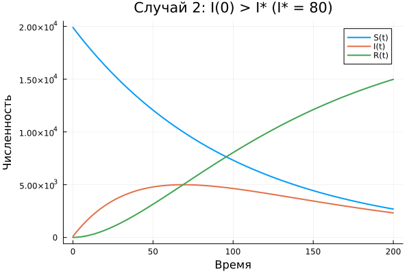

# Информация

## Докладчик

- Глеб Б.
- Студент РУДН
- glebb2005@mail.ru

# Введение

## Актуальность

- Эпидемиологические модели помогают прогнозировать распространение инфекций
- Учёт пороговых эффектов важен для моделирования карантинных мер
- Модель SIR с порогом I* описывает ситуацию изоляции больных

## Цели и задачи

**Цель:** Исследовать модель эпидемии SIR с пороговым значением I*.

**Задачи:**
1. Реализовать систему ОДУ с кусочным условием
2. Рассмотреть случай I(0) ≤ I*
3. Рассмотреть случай I(0) > I*
4. Сравнить динамику и сделать выводы

## Материалы и методы

- Язык: Julia
- Решатель ОДУ: Tsit5 (OrdinaryDiffEq)
- Визуализация: Plots.jl
- Управление проектом: DrWatson

# Модель

## Уравнения модели

Система с пороговым условием:

- dS/dt = –α·S при I > I*, иначе 0
- dI/dt = α·S – β·I при I > I*, иначе –β·I
- dR/dt = β·I (всегда)

## Параметры (Вариант 1)

| Параметр | Значение |
|----------|----------|
| N | 20 000 |
| I(0) | 99 |
| R(0) | 5 |
| S(0) | 19 896 |
| α | 0.01 |
| β | 0.02 |

# Результаты

## Случай 1: I(0) ≤ I* (I* = 150)

- Больные изолированы
- Новых заражений нет
- I(t) монотонно убывает до 0

## Случай 2: I(0) > I* (I* = 80)

- Заражение начинается немедленно
- Классический пик эпидемии
- Значительная часть популяции переболевает

## Сравнение I(t)

Качественное различие динамики при разных I*.

# Выводы

## Заключение

1. При I(0) ≤ I* эпидемия не развивается
2. При I(0) > I* — полноценная вспышка
3. Порог I* критически важен для динамики
4. Модель демонстрирует эффективность изоляции больных

## Инструменты

| Инструмент | Назначение |
|------------|------------|
| Julia | Язык программирования |
| OrdinaryDiffEq | Решение ОДУ |
| Plots | Визуализация |
| DataFrames, CSV | Обработка данных |
| DrWatson | Управление проектом |
| Quarto | Отчёт и презентация |
