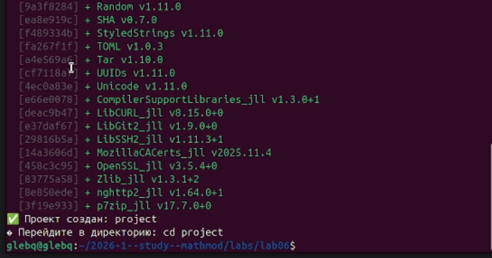
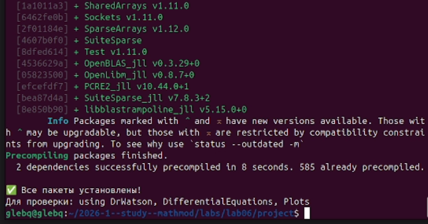
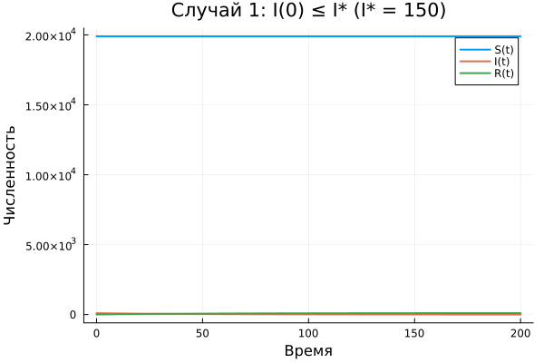
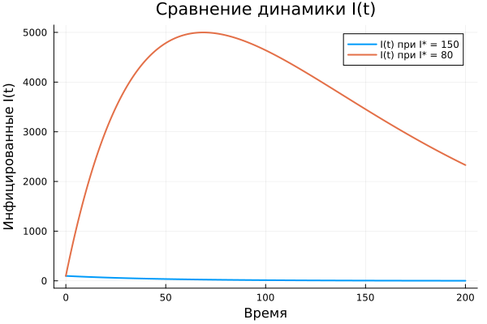

---
## Author
author:
  name: Беспутин Глеб Антонович
  email: glebb2005@mail.ru
  affiliation:
    - name: Российский университет дружбы народов
      country: Российская Федерация
      city: Москва
      address: ул. Миклухо-Маклая, д. 6

## Title
title: "Лабораторная работа №6"
subtitle: "Математическое моделирование: задача об эпидемии с пороговым значением"
license: "CC BY"
---

# Цель работы

Изучить математическую модель эпидемии SIR с пороговым значением I*. Исследовать два режима протекания эпидемии: когда начальное число инфицированных ниже критического порога и когда выше.

# Задание

1. Выбрать вариант начальных условий (N, I(0), R(0)).
2. Задать коэффициенты α и β, пороговое значение I*.
3. Реализовать систему ОДУ с кусочным условием.
4. Построить графики S(t), I(t), R(t) для случаев I(0) ≤ I* и I(0) > I*.
5. Сравнить динамику и сделать выводы.

# Теоретическое введение

## Модель SIR с порогом

Классическая модель SIR дополняется условием: пока число инфицированных I(t) не превышает критического значения I*, больные изолированы и не заражают здоровых. Скорость заражения становится ненулевой только при I(t) > I*.

Система уравнений:

- dS/dt = –α·S, если I > I*; 0, если I ≤ I*
- dI/dt = α·S – β·I, если I > I*; –β·I, если I ≤ I*
- dR/dt = β·I (всегда)

## Параметры

- α — коэффициент заболеваемости
- β — коэффициент выздоровления
- I* — критический порог числа инфицированных

# Выполнение лабораторной работы

## Настройка окружения

## Вариант 1

Исходные данные:
- N = 20 000
- I(0) = 99
- R(0) = 5
- S(0) = 19 896

Параметры: α = 0.01, β = 0.02.

## Случай 1: I(0) ≤ I*

Выбрано I* = 150 (> 99). Поскольку начальное число инфицированных ниже порога, заражение не происходит. Все больные изолированы и постепенно выздоравливают.

## Случай 2: I(0) > I*

Выбрано I* = 80 (< 99). Начальное число инфицированных превышает порог — заражение начинается немедленно. Эпидемия развивается по классическому сценарию SIR.

## Сравнение двух случаев

# Выводы

1. При I(0) ≤ I* эпидемия не развивается: инфицированные выздоравливают, новые заражения не происходят.

2. При I(0) > I* наблюдается вспышка эпидемии с характерным пиком заболеваемости.

3. Пороговое значение I* играет ключевую роль: превышение порога приводит к качественному изменению динамики системы.

4. Модель демонстрирует важность раннего выявления и изоляции больных для предотвращения эпидемии.



# Список литературы{.unnumbered}

1. Братусь А. С., Новожилов А. С., Платонов А. П. Динамические системы и модели биологии. — М.: Физматлит, 2010.
2. Kermack W. O., McKendrick A. G. A Contribution to the Mathematical Theory of Epidemics // Proc. R. Soc. A. — 1927.
